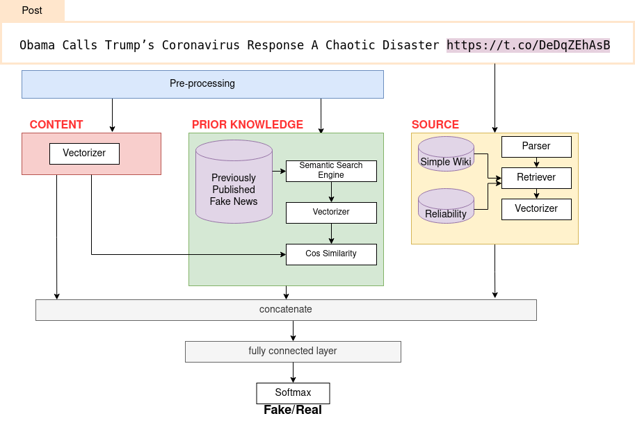

# Fake News Detection Framework for the Healthcare Domain
Stay tuned for the further updates... 

Run the main code `python -m src.cli`

# Datasets
The list of additional datasets for training/testing some of the components of the framework:
[FakeHealth](https://zenodo.org/record/3862989)
[NELA-2019](https://dataverse.harvard.edu/dataset.xhtml?persistentId=doi:10.7910/DVN/O7FWPO)
